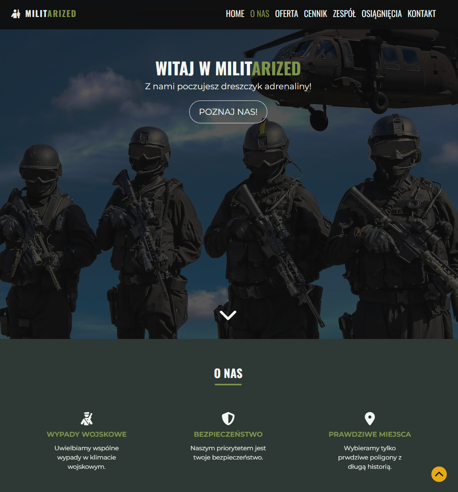

# Militarized — Training & Adventure Landing Page 🔫

A rebuilt and modernized landing page originally created as an old student project.
This version has been fully refactored, redesigned and optimized using modern front-end practices: Bootstrap 5, SCSS modules, mobile-first responsive design and scroll animations via AOS.js.
The goal: practice improving legacy code, working with external UI frameworks, and polishing real-world front-end workflow.



---

## 🔗 Live demo

https://flafii.github.io/militarized/

---

## 🛠 Tech Stack

- HTML5 (semantic layout)
- SCSS (modular structure + variables)
- Bootstrap 5
- JavaScript

  - DOM manipulation
  - navbar shadow logic
  - dynamic current year
  - mobile collapse handling

- AOS.js (scroll animations)
- RWD — mobile-first
- Git + GitHub

---

## ✨ Features

- Responsive layout (mobile / tablet / desktop)
- Bootstrap-based Team carousel
- Dynamic current year in footer
- Smooth section spacing and image assets
- Smooth scroll animations via AOS
- Improved accessibility (ARIA labels, alt attributes, rel="noopener")
- Reorganized file structure + SCSS partials
- Custom favicon set for all devices

---

## 📂 Project structure (important files)

/
├─ index.html
├─ css/
│ └─ style.css
├─ scss/
│ ├─ style.scss
│ ├─ \_reset.scss
│ ├─ \_colors.scss
│ ├─ \_components.scss
│ └─ \_sections.scss
├─ js/
│ └─ main.js
├─ img/
└─ README.md

---

## ▶️ How to run locally

```bash
# clone
git clone https://github.com/FlaFii/militarized.git

# open
cd militarized
# open index.html in browser (or use live server extension)
```

## 💡 What I learned

- Structuring SCSS with partials and @use
- How to refactor and rebuild an outdated project
- Using Bootstrap 5 properly + overriding components
- Debugging JS event listeners and DOM flow
- Implementing AOS.js scroll animations
- Splitting code into smaller files to keep code nice and tidy
- Improving accessibility with ARIA and semantic HTML
- Debugging responsive issues on multiple breakpoints
- Managing color palettes, typography scales, and design consistency
- Adding favicons & small branding elements to a project

## 👤 Author

FlaFii • https://github.com/FlaFii

Contact: mateusz.szymus7@gmail.com
